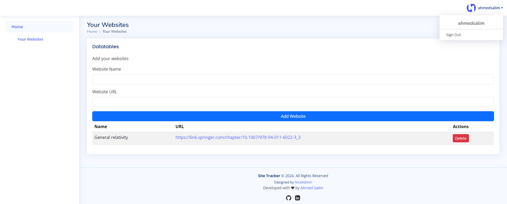

# flask-site-tracker

Simple web application built using Flask, it allows users to register, log in, and manage their favorite websites. Users can securely store website URLs in the database. 

The app will create an empty SQLite database if it wasn't defined in the [database](./database/) directory; the schema is defined within the same [folder](./database/schema.sql).



The app uses a partial of the [Nice Admin bootstrap template](https://bootstrapmade.com/nice-admin-bootstrap-admin-html-template/) to serve as a frontend.

## Installation

1. **Clone the Repository** from terminal:
    ```bash
    git clone https://github.com/ahmedsalim3/flask-site-tracker.git
    cd flask-site-tracker
    ```

2. **Create a Virtual Environment** (optional but recommended):
    - On Linux/MacOS:
        ```bash
        python -m venv <envname> # <envname> is your environment name
        source <envname>/bin/activate
        ```
    - On Windows:
        ```bash
        python -m venv <envname> # <envname> is your environment name
        .\<envname>\Scripts\activate
        ```
    - Using Conda:
        ```bash
        conda create --name <envname> python=3.12 # <envname> is your environment name
        conda activate <envname>
        ```

3. **Install Dependencies:**:
    ```bash
    pip install -r requirements.txt
    ```

## Run the App

1. Update the [configuration](./app/configs.py#L8) file if you need to change the database path or to get a fresh database. The default configuration should work for most cases.

2. Run the app:
    ```bash
    python app/app.py # from the root

    cd app 
    python app.py # from the app directory
    ```

3. Navigate to your local browser at `http://127.0.0.1:5000`.

## Features
1. **User Registration**: Users can create an account with a username and password
2. **User Authentication**: Secure login/logout functionality using Flask-Login
3. **Website Management**: Users can add, view, and delete their saved websites
4. **Password Hashing**: User passwords are securely hashed using bcrypt

## Technologies Used

1. [Bcrypt](https://pypi.org/project/bcrypt/) for hashing passwords and its [Tutorial](https://www.tutorialspoint.com/hashing-passwords-in-python-with-bcrypt)
2. Message Flashing using [Flashing With Categories](https://flask.palletsprojects.com/en/2.3.x/patterns/flashing/)
3. [Flask-WTF extension](https://flask-wtf.readthedocs.io/en/1.2.x/)
4. [WTF-Forms](https://wtforms.readthedocs.io/en/3.1.x/)
5. [URL-validators](https://wtforms.readthedocs.io/en/2.3.x/_modules/wtforms/validators/#URL)


## Repo's directory structure

The directory structure below shows the nature of files/directories used in this repo

```sh
.
├── README.md
├── requirements.txt   
│
├── app
│   ├── app.py          <- main app file
│   ├── configs.py      <- configuration file
│   ├── database.py
│   ├── forms.py
│   ├── static
│   └── templates       <- pages templates
│
├── database
│   ├── database.db     <- SQLite3 database
│   └── schema.sql      <- schema to setup the database
│
└── screenshots 
    ├── dashboard.png
    ├── index.png
    ├── login.png
    └── register.png

```

